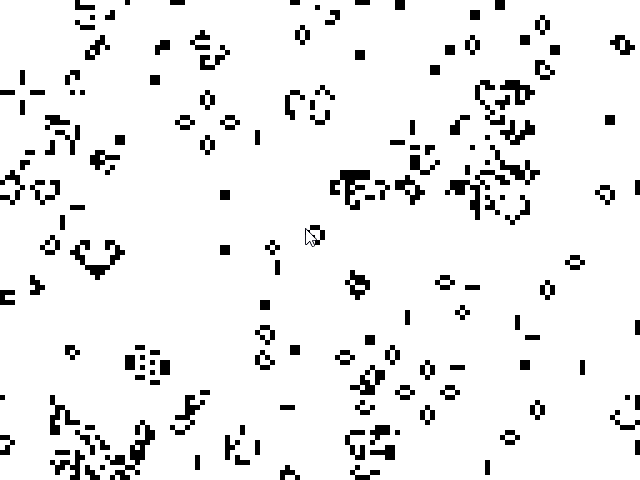

# Gol
## A graphical implementation of Conway's Game of Life

    

## About
[The Game of Life](https://en.wikipedia.org/wiki/Conway%27s_Game_of_Life), is a cellular automation, a zero-player game, devised by John Horton Conway. The game evolves solely based on its initial state, requiring no further input. One interacts with the Game of Life by creating an initial configuration and observing how it evolves. It is Turing complete and can simulate a universal constructor or any other Turing machine.

The universe of the Game of Life is an infinite, two-dimensional grid of square cells, each of which is in one of two possible states, _live_ or _dead_. Every cell interacts with its eight neighbours, which are the cells that are horizontally, vertically, or diagonally adjacent.

### Simplified rules of the game
1. Any live cell with two or three live neighbours survives.
2. Any dead cell with three live neighbours becomes a live cell.
3. All other live cells die in the next generation. Similarly, all other dead cells stay dead.

## Implementation
gol starts by randomly initializing a universe state, drawing and updating it every 40 milliseconds.

Window creation and drawing is done through [pixel](https://github.com/faiface/pixel) library.

## Installation and Usage
Install the latest version in `$GOBIN` or `$GOROOT/bin` by

    go get github.com/viswa/gol@latest

To run the simulation
    
    gol

## License
Gol is licensed under [MIT License](https://github.com/viswa/gol/blob/master/LICENSE).
